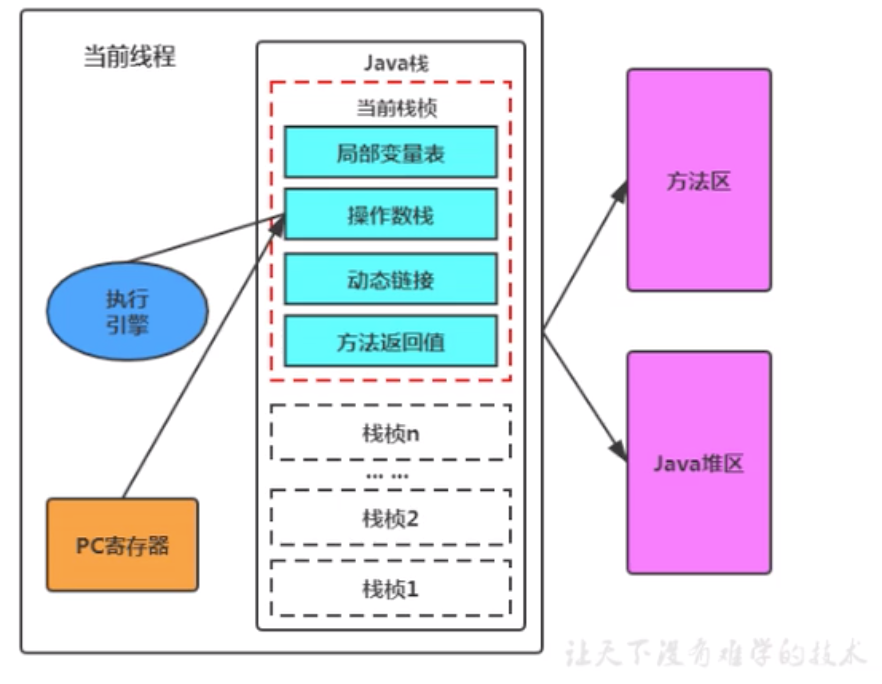

## JAVA内存模型（JMM）

> 我们常说的JVM内存模式指的是JVM的内存分区；而Java内存模式是一种虚拟机规范。
>
> JVM内存布局规定了JAVA在运行过程中内存申请、分配、管理的策略，保证了JVM的高效稳定运行。
>
> 一般来说，jvm优化95%是优化堆区，5%优化的是方法区。

​		java虚拟机规范中定义了Java内存模型（Java Memory Model, JMM）,用于屏蔽掉各种硬件和操作系统的内存访问差异，以实现让Java程序在各种平台下都能达到一致的并发效果，JMM规范了Java虚拟机与计算机内存是如何协同工作的；规定了一个线程如何和何时可以看到由其他线程修改后的共享变量的值，以及在必须时如何同步的访问共享变量。

​		Java内存模型（不仅仅是JVM内存分区）：调用栈和本地变量存放在线程栈上，对象放在堆上。
Java虚拟机会将栈细分为面向java方法的Java方法栈，面向本地方法（用c++写的native方法）的本地方法栈，以及存放各个线程执行位置的PC寄存器。

​		在程序运行过程种，每当调用进入一个Java方法时，Java虚拟机就会在当前线程的java方法栈种生成一个栈帧，用以存放局部变量、以及字节码的操作数。这个栈帧的大小是提前计算好的，而且Java虚拟机不要求栈帧在内存空间里连续分布。

​		当退出当前执行的方法时，不管是正常返回还是异常返回，Java虚拟机均会弹出当前线程的当前栈帧，并将之舍弃。
 

### 一、程序计数器（PC寄存器）：

​		对于java程序中每个运行的线程，都有一个PC寄存器用于存储指令相关的现场信息。CPU只有把数据装载到寄存器才能够运行。jvm中的PC寄存器是对物理PC寄存器的一种抽象模拟。

**作用：**

PC寄存器是用来存储指向下一条指令的地址，也即将要执行的执行代码。由执行引擎读取下一条指令。

- 它是一块很小的内存空间，几乎可以忽略不计。也是运行速度最快的存储区域。
- 在jvm规范中，每个线程都有它自己的程序计数器，是线程私有的，生命周期与线程的生命周期保持一致。
- 在任何时间一个线程都只有一个方法在执行，也就是所谓的**当前方法**。程序计数器会存储当前线程正在执行的java方法的jvm指令地址；或者，如果是在执行native方法，则是末指定值（undefined）。
- 它是程序控制流的指示器，分支、循环、跳转、异常处理、线程恢复等基础功能都需要依赖这个计数器来完成。
- 字节码解释器工作时就是通过改变这个计数器的值来选取下一条需要执行的字节码指令。
- 它是唯一一个在java虚拟机规范中没有规定任何OOM情况的区域。

### 二、JVM栈：

​		对于每个线程，都会分配一个栈/线程栈（JVM Stack），用于存储栈帧（Frame）。

​		**优势：**存取速度比较快，仅次于CPU中的寄存器；

​		**缺点：**存在栈中的数据大小与生存期必须是确定的，缺乏灵活性。

### 三、栈帧（Frame）：

​		栈帧由返回值、操作数栈、局部变量数组以及一个class引用组成。

​		<u>局部变量数组</u>：索引从0到它的长度-1，**长度**是由编译器计算的，一个局部变量可以保存任何变量的值，long和double类型的值占用两个局部变量。

​		<u>操作数栈</u>：存储指令的操作数，或者方法调用的参数。

### 四、方法区：

​		对于每个已加载的类，它存储方法的代码和一个符号表（例如对字段或方法的引用）和常量池。

### 五、堆（Heap）：

​		所有线程共享的内存和存储对象（类实例和数组）。对象回收是由垃圾收集器管理的。

​		<u>优势：</u>可以动态的分配内存大小，所有使用new xxx()构造出来的对象都在堆中存储，生存期也不必事先告诉编译器，GC会自动收走不再使用的数据。

​		<u>缺点：</u>由于要在运行时动态分配内存，存取速度较慢。

####  5.1 堆分代模型

- **新生代Young（伊甸区Eden，存活区S0，存活区S1）**

  ​		新生代中大部分对象的生命周期都是短暂的，所以将内存划分为一块较大的Eden区和两块较小的大小严格相同的Survivor1、Survivor2，默认大小为 8：1：1，其中Survivor区，某一时刻只有其中某一个是被使用的，两一个留着供垃圾回收时候复制对象使用。（具体可参考垃圾回收章节）

- **老年代Tenured** 

  ​		Tenured区主要保存生命周期长的对象，一般都是一些老对象。

  ​		一般系统中使用了application级别的缓存，缓存中的对象往往会被转移到这一区间（什么对象会直接进入老年代可参考垃圾回收章节）。

  ​		当老年代中没有足够的内存空间来存放对象时，虚拟机会发起一次Major GC/Full GC。其实不论是Minor GC或者Major GC都存在这么一个问题，怎么处理跨代引用？因此通常Major都会回收年轻代。 

- **jdk1.7 永久代（perm）**

  ​		Perm Gen代主要保存class,method,filed对象，这部份的空间一般不会溢出，除非一次性加载了很多的类，不过在涉及到热部署的应用服务器的时候，有时候会遇到java.lang.OutOfMemoryError : PermGen space 的错误，造成这个错误的很大原因就有可能是每次都重新部署，但是重新部署后，类的class没有被卸载掉，这样就造成了大量的class对象保存在了perm中，这种情况下，一般重新启动应用服务器可以解决问题。 

- **jdk1.8 元空间（meta space）**

  ​		Metaspace所占用的内存空间不是在虚拟机内部，而是在本地内存空间中，这也是与1.7的永久代最大的区别所在。

  ​		JDK1.8与JDK1.7最大的区别是：**JDK1.8将永久代取消，取而代之的是元空间，在JDK1.8中方法区是由元空间来实现**，所以原来属于方法区的运行时常量池就属于元空间了。
  ​		元空间属于**本地内存**，所以元空间的大小仅受本地内存限制，但是可以通过-XX:MaxMetaspaceSize进行增长上限的最大值设置，默认值为4G，元空间的初始空间大小可以通过-XX:MetaspaceSize进行设置，默认值为20.8M，还有一些其他参数可以进行设置，元空间大小会自动进行调整。 

### 参考资料：

- [Java内存模型（JMM）总结](https://zhuanlan.zhihu.com/p/29881777)
- [Java堆内存的GC模型以及分代机制](https://blog.csdn.net/weixin_43767015/article/details/105196418)
- [JDK1.7和1.8的JVM运行时数据区域(JVM内存模型)的主要区别](https://blog.csdn.net/weixin_43767015/article/details/105189239)

